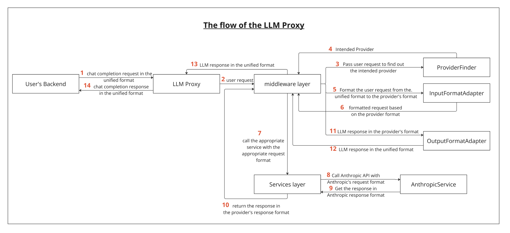

# LLM Proxy

`llm-proxy` is a TypeScript library that provides a unified interface for interacting with multiple large language model (LLM) providers, such as OpenAI and Anthropic. The library simplifies cross-provider communication by standardizing input and output formats, allowing users to call different providers with consistent request and response structures. This proxy library also supports both streaming and non-streaming responses.

## Features

- Unified Interface: Send chat completion requests in a consistent format, regardless of the underlying LLM provider.

- Automatic Provider Detection: The library determines the appropriate provider (OpenAI, Anthropic, etc.) based on the model specified in the request.

- Streamed and Non-Streamed Responses: Separate functions handle streaming and non-streaming responses, giving flexibility in response handling.

- Modular Design: Includes distinct middleware and service layers for handling provider-specific logic and request formatting.

## Installation

Install `llm-proxy` via npm:

```bash
npm install llm-proxy
```

## Usage

usage discription goes here

## Theory - How It Works ?

Workflow Overview

1. User Request: The user sends a chat completion request in a unified format. The request is passed to the llm-proxy.

2. Middleware Layer:

- ProviderFinder: Identifies the intended provider (e.g., OpenAI, Anthropic) based on the model specified in the request.
- InputFormatAdapter: Transforms the request from the unified format into the format expected by the identified provider.

3. Service Layer:

- ClientService: A general service interface that routes the request to the correct provider-specific service.
- Provider-Specific Services: For example, AwsBedrockAnthropicService and OpenAIService handle the actual API communication with Anthropic via AWS Bedrock or OpenAI directly.

4. Response Handling:
   OutputFormatAdapter: Transforms the provider-specific response back into the unified format.

5. Return Response: The final response is returned to the user in the unified format.

## Detailed Components

1.  Middleware Layer:

- ProviderFinder: Determines which provider to use based on the model in the request (e.g., "Claude" indicates Anthropic).
- InputFormatAdapter: Adapts the request from the unified format to the provider's specific format.
- OutputFormatAdapter: Converts the provider-specific response into the unified format.

2. Service Layer:

- ClientService: A high-level service that selects the appropriate provider service.
- AwsBedrockAnthropicService: Handles requests and responses for Anthropic models via AWS Bedrock.
- OpenAIService: Manages requests and responses for OpenAI models.

## Architecture Diagram

Below is a flow diagram illustrating how llm-proxy processes requests.



## Contributing

Contributions are welcome! Please follow the standard GitHub flow for submitting issues and pull requests.

## License
This project is licensed under the MIT License.
